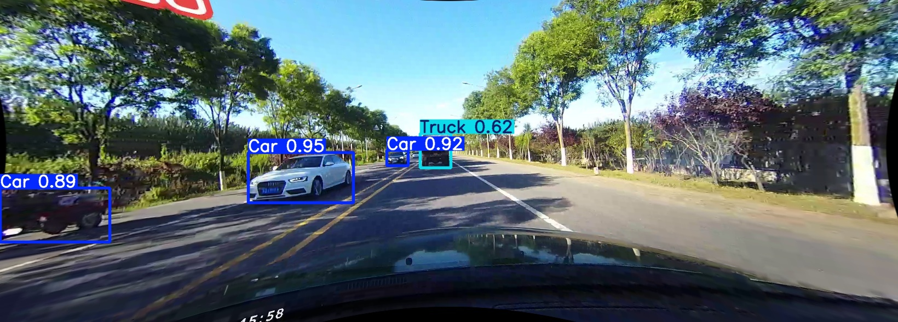

Here is the complete `README.md`. You can copy this code block directly into your file.

````markdown
# 🚗 Real-Time Object Detection with YOLOv10 (KITTI)


> A high-performance object detection system for autonomous driving, trained on the **KITTI Benchmark Dataset**.




---

## 📖 Overview
This project implements a state-of-the-art **Object Detection** module using **YOLOv10**. It is designed as the perception layer for an autonomous vehicle stack (integrated with Lane Detection and Traffic Sign Recognition).

The model identifies **7 specific road classes** critical for urban driving decision-making. By leveraging the YOLOv10 architecture, the system achieves a balance between high accuracy and real-time latency suitable for embedded deployment.

---

## 📌 Key Achievements
* 🚀 **Real-Time Performance:** Optimized inference achieving **40–60 FPS** on standard hardware.
* 🎯 **High Accuracy:** Reached an **mAP50 of 91.7%** on the KITTI validation set.
* 🚛 **Robust Vehicle Detection:** Specifically tuned for high recall on Cars (85.9%) and Trucks (88.5%).
* 🔄 **Data Engineering:** Implemented a robust ETL pipeline to convert KITTI's raw text-based labels into normalized YOLO formats.

---

## 📊 Performance Metrics
The model was evaluated on the KITTI validation split across 7 classes (`Car`, `Truck`, `Pedestrian`, `Cyclist`, `Van`, `Person_sitting`, `Tram`).

| Metric | Score | Notes |
| :--- | :--- | :--- |
| **mAP50 (All Classes)** | **91.7%** | Excellent general detection capabilities |
| **mAP50-95** | 72.3% | High precision bounding boxes |
| **Car Accuracy** | **85.9%** | Critical for collision avoidance systems |
| **Truck Accuracy** | **88.5%** | Reliable detection of large obstacles |

---

## 🛠️ Tech Stack
* **Model Architecture:** YOLOv10 (Ultralytics / Official Implementation)
* **Framework:** PyTorch
* **Dataset:** KITTI Object Detection Benchmark
* **Tools:** OpenCV, NumPy, Pandas, Matplotlib

---

## 🚀 Getting Started

### 1️⃣ Installation
Clone the repository and install the required dependencies:

```bash
git clone [https://github.com/AmanouNasri1/YOLOv10-KITTI-ObjectDetection.git](https://github.com/AmanouNasri1/YOLOv10-KITTI-ObjectDetection.git)
cd YOLOv10-KITTI-ObjectDetection
pip install -r requirements.txt
````

### 2️⃣ Data Preparation

The project includes scripts to process the raw KITTI dataset.

1.  Download the [KITTI Object Detection Dataset](http://www.cvlibs.net/datasets/kitti/eval_object.php).
2.  Use the conversion script in `data/` to generate YOLO-compatible labels:
    ```bash
    python data/kitti_to_yolo.py --input /path/to/kitti --output /path/to/yolo
    ```

### 3️⃣ Run Inference

To test the pre-trained model on a video file or live webcam:

```bash
# Run on video file
python src/inference.py --source test_drive.mp4 --weights best.pt

# Run on Webcam
python src/inference.py --source 0
```

-----

## 🧠 Engineering Challenges

  * **Label Normalization:** Developed a custom parser to translate KITTI's 2D bounding box coordinates into YOLO's normalized center-point format $(x, y, w, h)$.
  * **Class Imbalance:** Addressed the scarcity of minority classes (e.g., `Tram`, `Person_sitting`) using data augmentation techniques during the training pipeline.
  * **Latency Optimization:** Tuned the inference loop to ensure the model runs fast enough (\>30 FPS) for real-world autonomous driving applications without sacrificing mAP.

-----

## 📜 License

This project is licensed under the MIT License - see the [LICENSE](https://www.google.com/search?q=LICENSE) file for details.

```
```